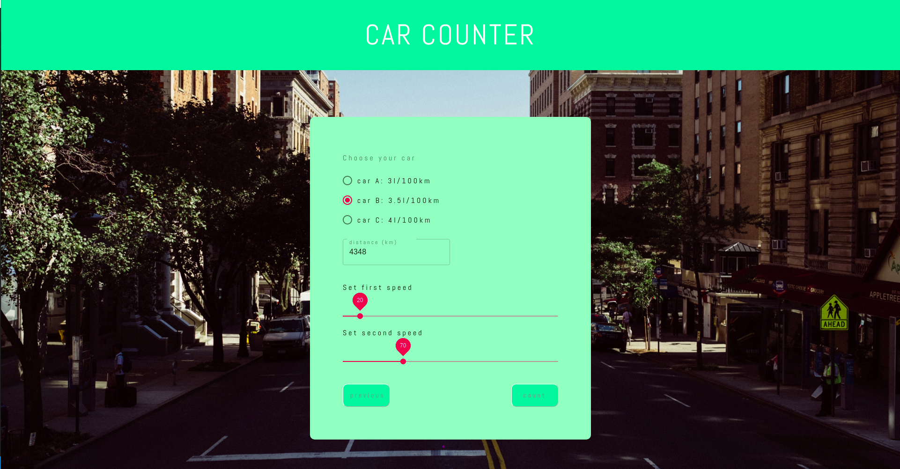
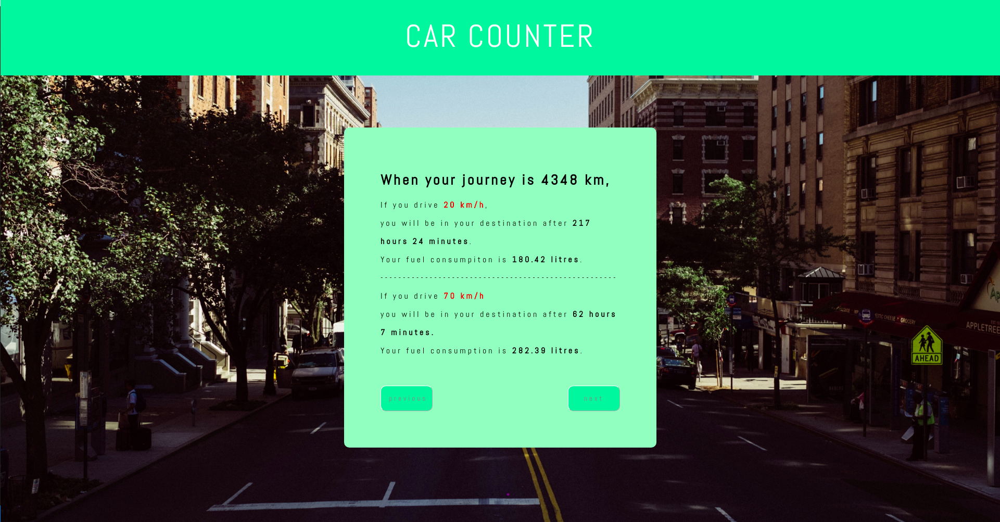
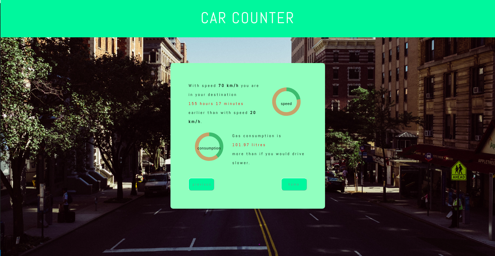

# Car counter
User chooses a car based on consumption, fills the distance and sets two speeds.  
Application will tell how much faster the faster speed is and how much more the faster speed consumes gasoline compairing to the slower speed.

Assignment: https://koodihaaste.solidabis.com/#/ .

## Build with
- React

## Created and tested with
- Ubuntu 20.04
- Chrome

## Components
- [material-ui radiobutton](https://material-ui.com/components/radio-buttons/)
- [material-ui slider](https://material-ui.com/components/slider/)
- [material-ui textfield](https://material-ui.com/api/text-field/)
- [react-donut-component](https://github.com/guilhermefront/react-donut-component)
- [react-slick](https://react-slick.neostack.com/)
- [material-ui styles](https://material-ui.com/styles/basics/#material-ui-core-styles-vs-material-ui-styles)

Background picture from https://unsplash.com/.

## Try the project
As prequisite you need to have the following installed:
- [Node.js](https://nodejs.org/en/)
- [Git](https://git-scm.com/)

### Clone the project
    $ git clone https://github.com/kri-ku/car_counter.git

### Navigate to the project:

    $ cd /path_to/car_counter
### Run

    $ npm install
    $ npm start

App will start in the http://localhost:3000.

### Examples

